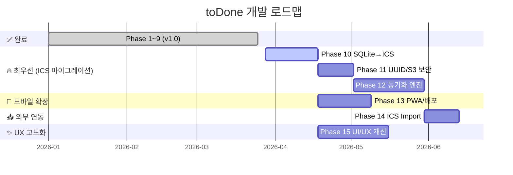

# 📍 toDone 개발 로드맵

> **최종 갱신일:** 2026-03-27  
> 본 문서는 GitHub Issues를 기반으로 구성된 전체 개발 로드맵입니다.

---

## ✅ 완료된 마일스톤 (v1.0 — Completed)

| Phase | 핵심 목표 |
|-------|----------|
| Phase 1 | 초기 세팅 및 DevOps — Tauri + React(Vite) + Tailwind CSS, CI/CD 파이프라인 구축 |
| Phase 2 | UI 뼈대 및 컴포넌트 개발 — Stitch MCP 연결, Atomic 디자인 패턴 적용 |
| Phase 3 | 로컬 데이터베이스 연동 — SQLite 스키마, IPC 통신 및 CRUD 구현 |
| Phase 4 | 트레이 앱(메뉴바) 동작 및 OS 최적화 — 메인 윈도우 프레임 제거, Tray 연결 |
| Phase 5 | 일간(Daily) 및 전체(All) 칸반 보드 고도화 — 3단계 상태 칸반, DnD 구현 |
| Phase 6 | 전역 캘린더 스트립 및 주간(Weekly) 뷰 구현 |
| Phase 7 | 작업 상세 모달 및 스마트 반복(Recurring) 1차 로직 |
| Phase 8 | UX 폴리싱 및 완전 자동화 스케줄링 — 반복 작업 탭 분리, 징검다리 스케줄러 |
| Phase 9 | 최종 릴리즈 및 배포 — v1.0.0 공식 배포 (진행 중) |

---

## 🚀 Phase 10: 코어 데이터 저장소 마이그레이션 — SQLite → ICS 포맷

> **핵심 목표:** 기존 SQLite 의존성을 완전히 제거하고, 모든 할 일·일정 데이터를 국제 표준 iCalendar(`.ics`) 포맷으로 전환합니다. 이후 모든 Phase의 기반이 되는 가장 중요한 작업입니다.

**관련 이슈:** [#1 모바일 앱 개발 및 연동](https://github.com/seunghok22/toDone/issues/1), [#3 ICS 기반 단일 상태 관리 및 클라우드 동기화](https://github.com/seunghok22/toDone/issues/3)

- **#3 — Task 2.1** 코어 데이터 저장소 마이그레이션 및 쓰기 성능 최적화
  - 기존 SQLite 연동 코드 및 의존성 제거
  - `ical.js` / `ics` 패키지를 활용한 `.ics` 직렬화·역직렬화 유틸리티(`icsParser.ts`) 구현
  - In-Memory First 전략: Zustand 상태 즉시 업데이트 → UI 지연 방지
  - Debounce 기반 지연 저장: 입력 정지 후 3~5초 후 백그라운드 `.ics` 파일 덮어쓰기
  - 스토리지 어댑터: Tauri → 로컬 FS / PWA → IndexedDB 또는 localStorage 플랫폼 분기 처리

---

## 🔐 Phase 11: 사용자 식별 및 S3 보안 격리

> **핵심 목표:** 유저별 UUID를 발급하고, AWS Cognito 연동을 통해 개인 S3 경로에만 접근 가능하도록 보안을 구축합니다.

**관련 이슈:** [#3 ICS 기반 단일 상태 관리 및 클라우드 동기화](https://github.com/seunghok22/toDone/issues/3)

- **#3 — Task 2.2** 사용자 고유 식별자(UUID) 발급 및 S3 접근 격리
  - 앱 최초 실행 시 UUID(v4) 생성 → 로컬 스토리지 영구 저장
  - AWS Cognito를 통한 임시 S3 접근 자격 증명(Role) 발급
  - S3 IAM 정책: `s3://[버킷]/users/${UUID}/*`경로에만 PutObject/GetObject 허용

---

## ☁️ Phase 12: 클라우드 동기화 엔진 — S3 기반 실시간 병합

> **핵심 목표:** 데스크톱(Tauri)과 모바일(PWA) 간 완벽한 상태 동기화를 구현하고, 동시 수정·오프라인 상황에서도 데이터 유실 없는 병합 엔진을 탑재합니다.

**관련 이슈:** [#3 ICS 기반 단일 상태 관리 및 클라우드 동기화](https://github.com/seunghok22/toDone/issues/3)

- **#3 — Task 2.3.1** 데이터 규격 정비 및 Tombstone 로직 적용
  - 모든 일정에 고유 `UID` + `LAST-MODIFIED` 타임스탬프 필수 부여
  - 삭제 시 Soft Delete(`STATUS:CANCELLED`) 적용, UI에서만 숨김 처리
- **#3 — Task 2.3.2** S3 충돌 감지 (Optimistic Locking)
  - 다운로드 시 ETag 저장, 업로드 전 `If-Match` 헤더로 일치 여부 검증
- **#3 — Task 2.3.3** 프론트엔드 Merge 엔진 개발
  - ETag 불일치(충돌) 감지 시 S3 최신 파일 다운로드 → UID 기준 비교 → `LAST-MODIFIED` 최신 이벤트 우선 병합
- **#3 — Task 2.3.4** 네트워크 상태 감지 및 큐 처리
  - `navigator.onLine` 기반 오프라인 감지 → 로컬 큐 적재 → 온라인 복귀 시 자동 Merge & Sync

---

## 📱 Phase 13: PWA 기반 모바일 지원 및 배포

> **핵심 목표:** React 프론트엔드를 PWA로 확장하여 모바일 브라우저에서 네이티브 앱 수준의 경험을 제공하고, 자동 배포 파이프라인을 구축합니다.

**관련 이슈:** [#1 모바일 앱 개발 및 연동](https://github.com/seunghok22/toDone/issues/1), [#2 PWA 기반 모바일 웹 지원](https://github.com/seunghok22/toDone/issues/2)

- **#2 — Task 1.1** PWA 환경 구성 (Manifest & Service Worker)
  - `vite-plugin-pwa` 설정, 앱 아이콘 생성, `manifest.json` 구성
  - Service Worker를 통한 정적 리소스 캐싱 (오프라인 로드 지원)
- **#2 — Task 1.2** 모바일 디바이스 대응 반응형 UI 개선
  - 주요 컴포넌트에 터치 스와이프 이벤트 추가
  - Breakpoint 기반 하단 내비게이션 바 / 햄버거 메뉴 레이아웃 분리
- **#2 — Task 1.3** 웹(PWA) 프로덕션 배포 파이프라인 구축
  - GitHub Actions 기반 자동 빌드 → AWS S3 동기화 + CloudFront 캐시 무효화
  - (대안 검토) Vercel / Cloudflare Pages 연동

---

## 📥 Phase 14: 외부 캘린더 Import

> **핵심 목표:** 구글 캘린더, 애플 캘린더 등 외부 서비스에서 내보낸 `.ics` 파일을 앱으로 가져와 기존 데이터와 안전하게 병합합니다.

**관련 이슈:** [#3 ICS 기반 단일 상태 관리 및 클라우드 동기화](https://github.com/seunghok22/toDone/issues/3)

- **#3 — Task 2.4** 외부 캘린더 ICS 파일 Import 기능 구현
  - `SettingsModal.tsx`에 '.ics 파일 업로드' UI 추가
  - 외부 `.ics` 파싱 → `useTaskStore` 데이터 병합 (UID 대조로 중복 방지)
  - 병합 완료 후 로컬 캐시 + S3 자동 최신화

---

## ✨ Phase 15: UI/UX 고도화 및 사용자 편의성 강화

> **핵심 목표:** 마감일 경고, 검색, 자동 정리, 달력 UX 개선 등을 통해 서비스 완성도를 한 단계 끌어올립니다.

**관련 이슈:** [#4 UI/UX 고도화 및 사용자 편의성 강화](https://github.com/seunghok22/toDone/issues/4), [#5](https://github.com/seunghok22/toDone/issues/5), [#6](https://github.com/seunghok22/toDone/issues/6), [#7](https://github.com/seunghok22/toDone/issues/7), [#8](https://github.com/seunghok22/toDone/issues/8), [#9](https://github.com/seunghok22/toDone/issues/9)

- **#8** 기한 초과(Overdue) 미완료 작업 시각적 강조 표시
  - 조건: `현재 날짜 > dueDate` AND `completed === false`
  - 붉은색 뱃지 또는 경고 테두리 조건부 CSS 적용
- **#9** 마감일 없는(No Deadline) 상시 노출 태스크 등록 지원
  - 추가/수정 모달에서 '기한 없음' 옵션 제공
  - Daily 뷰에서 기한 없는 태스크 항상 노출
- **#6** 태스크 검색(Search) 기능 구현
  - 상단 헤더에 검색 아이콘 + 텍스트 입력 필드 추가
  - 제목/내용 기준 실시간 필터링, 결과 클릭 시 상세 모달 연결
- **#7** 추가/수정 모달 내 달력(Date Picker) UX/UI 개선
  - 달력 컴포넌트 크기 상향, 날짜 선택 시 자동 닫힘 로직 추가
- **#5** 마감 기한 초과 태스크 자동 삭제 및 사용자 설정 기능
  - `SettingsModal`에 '오래된 작업 자동 삭제' 설정 항목 추가 (끄기 / 7일 / 30일)
  - 앱 로드 시 설정 기한 초과 태스크 일괄 삭제 로직

---

