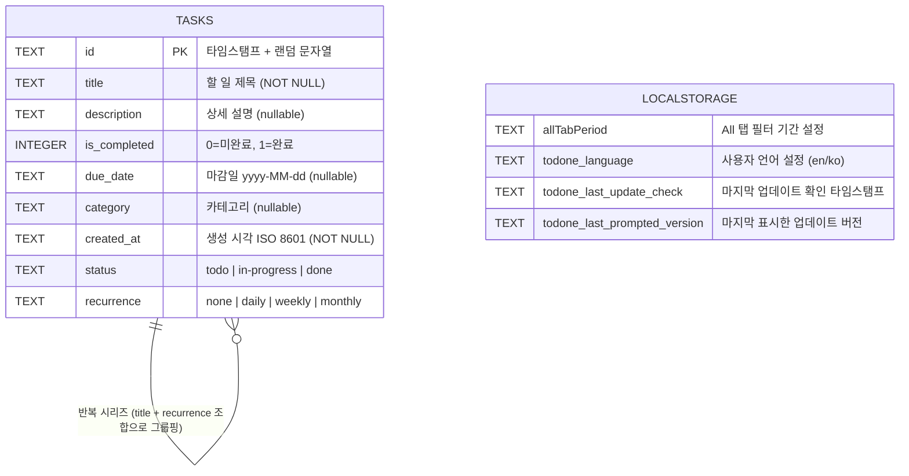
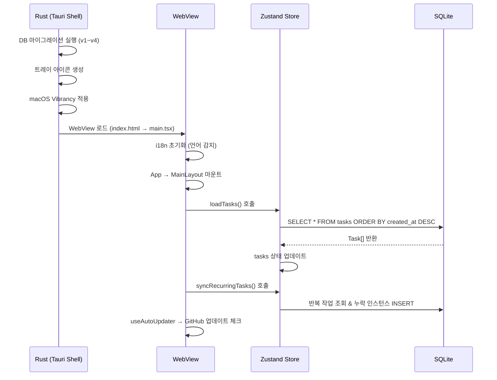
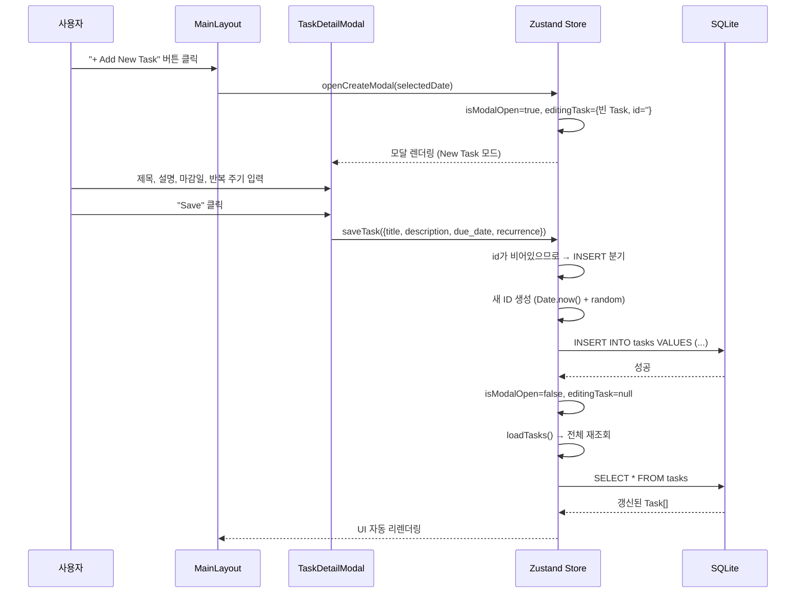
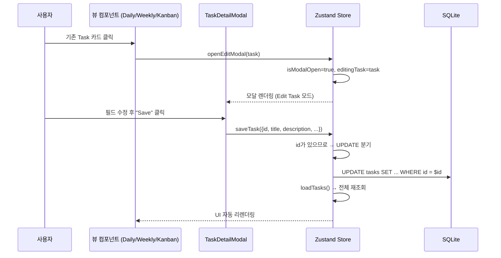
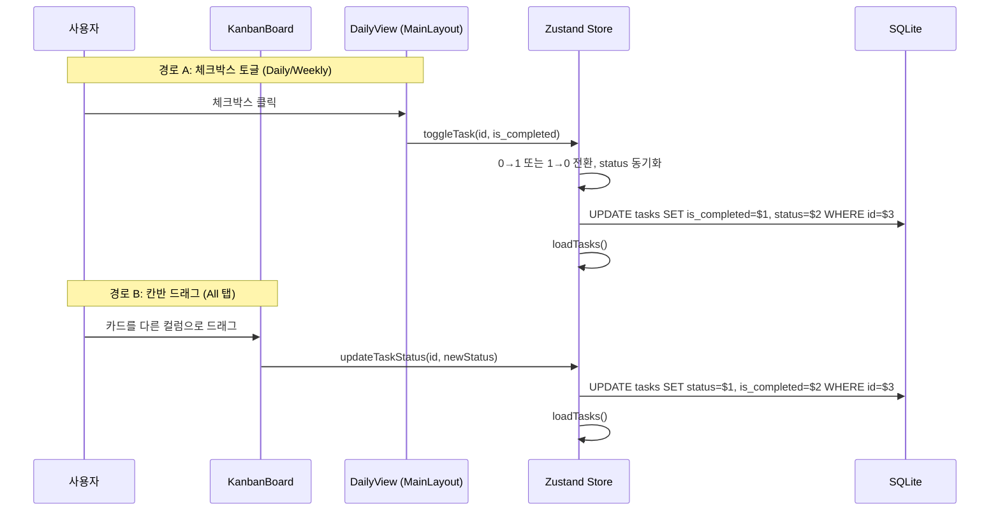
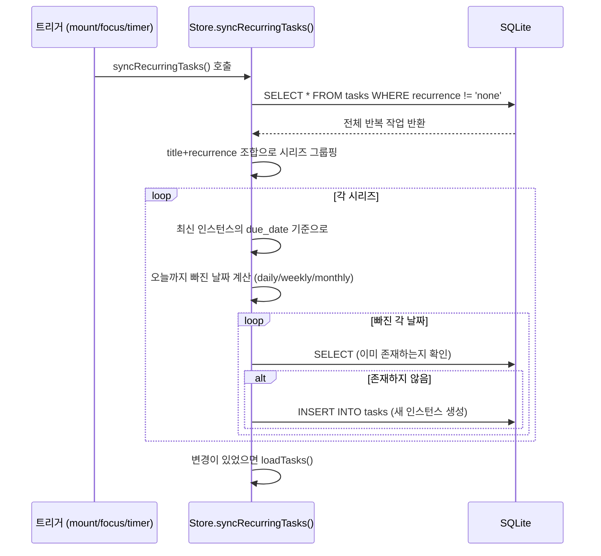
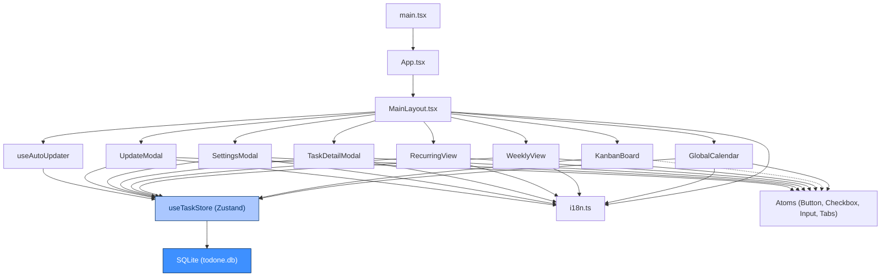

# 📐 toDone — 시스템 아키텍처 문서

> **버전:** 1.3.1 | **최종 업데이트:** 2026-03-25

---

## 1. 시스템 아키텍처 (System Architecture)

### 1.1 전체 구조 개요

toDone은 **Tauri 2 기반의 데스크톱 트레이 앱**으로, macOS 메뉴바 / Windows 트레이에서 클릭 한 번으로 열리는 경량 할 일 관리자입니다.

```
┌─────────────────────────────────────────────────────────────┐
│                     사용자 (macOS / Windows)                  │
│                        트레이 아이콘 클릭                      │
└───────────────────────────┬─────────────────────────────────┘
                            │
           ┌────────────────▼────────────────┐
           │        Tauri Shell (Rust)       │
           │   • 트레이 아이콘 관리              │
           │   • 윈도우 위치 계산 & 포커스         │
           │   • macOS Vibrancy 효과          │
           │   • SQLite DB 마이그레이션 관리      │
           │   • 자동 업데이트 (plugin-updater)  │
           └────────────────┬────────────────┘
                            │ IPC (Tauri Commands)
           ┌────────────────▼────────────────┐
           │     Frontend (React + Vite)     │
           │   ┌──────────────────────────┐  │
           │   │   Zustand Store          │  │
           │   │   (useTaskStore)         │  │
           │   │   • 전역 상태 관리          │  │
           │   │   • SQLite CRUD 직접 실행  │  │
           │   │   • 반복 작업 자동 동기화     │  │
           │   └────────────┬─────────────┘  │
           │                │                │
           │   ┌────────────▼─────────────┐  │
           │   │   React UI Components     │  │
           │   │   (Atomic Design)         │  │
           │   │   Pages → Organisms       │  │
           │   │   → Molecules → Atoms     │  │
           │   └──────────────────────────┘  │
           └────────────────┬────────────────┘
                            │ @tauri-apps/plugin-sql
           ┌────────────────▼────────────────┐
           │        SQLite Database          │
           │        (todone.db)              │
           │   • 로컬 파일 시스템에 저장          │
           │   • 외부 서버 통신 없음             │
           └─────────────────────────────────┘
```

### 1.2 기술 스택 상세

| 계층 | 기술 | 역할 |
|------|------|------|
| **런타임** | Tauri 2 (Rust) | 네이티브 윈도우, 트레이 아이콘, 시스템 API 브릿지 |
| **프론트엔드 프레임워크** | React 19 + TypeScript | 선언적 UI 렌더링 |
| **빌드 도구** | Vite 7 | 빠른 HMR 개발 서버 & 번들링 |
| **스타일링** | Tailwind CSS 4 + shadcn/ui | 유틸리티 퍼스트 CSS + 재사용 가능 UI 프리미티브 |
| **상태 관리** | Zustand 5 | 보일러플레이트 없는 글로벌 상태 관리 |
| **데이터베이스** | SQLite (`@tauri-apps/plugin-sql`) | 로컬 영구 저장소, Rust 사이드에서 마이그레이션 |
| **국제화** | i18next + react-i18next | 한국어/영어 다국어 지원 |
| **날짜 처리** | date-fns | 경량 날짜 유틸리티 (반복 작업, 캘린더 등) |
| **드래그 앤 드롭** | @dnd-kit/core + sortable | 칸반 보드 카드 드래그 |
| **자동 업데이트** | @tauri-apps/plugin-updater | GitHub Releases 기반 자동 업데이트 |
| **디자인 시스템** | CSS Custom Properties (Dark Theme) | macOS Vibrancy와 조화되는 커스텀 다크 테마 |

### 1.3 핵심 아키텍처 특징

- **서버리스 (Serverless):** 백엔드 서버가 없으며, 모든 데이터는 로컬 SQLite에 저장됩니다.
- **프론트엔드 직접 DB 접근:** Zustand Store가 `@tauri-apps/plugin-sql`을 통해 SQLite에 직접 SQL 쿼리를 실행합니다. 별도의 Tauri Command(IPC)를 거치지 않습니다.
- **트레이 전용 앱:** 독립 윈도우가 아니라 트레이 아이콘 클릭으로 토글되며, 포커스를 잃으면 자동으로 숨겨집니다.
- **macOS Private API:** `NSVisualEffectMaterial::HudWindow` vibrancy를 적용하여 반투명 블러 배경을 구현합니다.

---

## 2. 데이터 모델 및 ERD

### 2.1 Task 엔티티

toDone은 단일 테이블(`tasks`) 구조로, 모든 할 일 데이터를 하나의 엔티티에 통합 관리합니다.

| 컬럼 | 타입 | 필수 | 기본값 | 설명 |
|------|------|------|--------|------|
| `id` | `TEXT` | PK | — | 타임스탬프 + 랜덤 문자열 조합 (예: `1711234567890abc12`) |
| `title` | `TEXT` | ✅ | — | 할 일 제목 |
| `description` | `TEXT` | ❌ | `NULL` | 할 일 상세 설명 (v4 마이그레이션 추가) |
| `is_completed` | `INTEGER` | ✅ | `0` | 완료 여부 (`0` = 미완료, `1` = 완료) |
| `due_date` | `TEXT` | ❌ | `NULL` | 마감일 (`'yyyy-MM-dd'` 형식) |
| `category` | `TEXT` | ❌ | `NULL` | 카테고리 (현재 `'daily'`로 고정 사용) |
| `created_at` | `TEXT` | ✅ | — | 생성 시각 (ISO 8601 문자열) |
| `status` | `TEXT` | ✅ | `'todo'` | 작업 상태: `'todo'` \| `'in-progress'` \| `'done'` (v2 추가) |
| `recurrence` | `TEXT` | ✅ | `'none'` | 반복 주기: `'none'` \| `'daily'` \| `'weekly'` \| `'monthly'` (v3 추가) |

### 2.2 ERD 다이어그램



> **참고:** 반복 작업은 별도 테이블이 아니라, 동일한 `title` + `recurrence` 조합을 가진 여러 `tasks` 레코드로 관리됩니다. 스케줄링 시 새 인스턴스가 INSERT됩니다.

### 2.3 DB 마이그레이션 히스토리

마이그레이션은 Rust 사이드(`src-tauri/src/lib.rs`)에서 `tauri_plugin_sql::Migration`으로 관리됩니다.

| 버전 | 설명 | SQL |
|------|------|-----|
| v1 | 기본 tasks 테이블 생성 | `CREATE TABLE tasks (id, title, is_completed, due_date, category, created_at)` |
| v2 | 상태 컬럼 추가 | `ALTER TABLE tasks ADD COLUMN status TEXT DEFAULT 'todo'` |
| v3 | 반복 주기 컬럼 추가 | `ALTER TABLE tasks ADD COLUMN recurrence TEXT DEFAULT 'none'` |
| v4 | 설명 컬럼 추가 | `ALTER TABLE tasks ADD COLUMN description TEXT` |

---

## 3. 디렉토리 구조 및 핵심 파일의 역할

```
toDone/
├── src/                          # 프론트엔드 소스 (React + TypeScript)
│   ├── main.tsx                  # React 앱 엔트리포인트 (StrictMode 렌더링)
│   ├── App.tsx                   # 루트 컴포넌트 (MainLayout 렌더링만 담당)
│   ├── App.css                   # 글로벌 CSS: Tailwind 설정, 다크 테마 변수, 투명 배경 스타일
│   ├── i18n.ts                   # i18next 초기화: en/ko 번역 리소스 인라인 정의 및 언어 감지
│   │
│   ├── store/
│   │   └── useTaskStore.ts       # ⭐ Zustand 글로벌 스토어: 모든 상태와 CRUD 로직의 중심
│   │
│   ├── hooks/
│   │   └── useAutoUpdater.ts     # 자동 업데이트 훅: 24시간 주기 체크, 버전별 1회 팝업
│   │
│   ├── pages/
│   │   └── MainLayout.tsx        # ⭐ 메인 페이지: 탭 구조 (Daily/Weekly/Recurring/All) + 캘린더
│   │
│   ├── organisms/                # 복합 UI 컴포넌트 (비즈니스 로직 포함)
│   │   ├── KanbanBoard.tsx       # All 탭: 3열 칸반 보드 (Todo/In-Progress/Done) + DnD
│   │   ├── WeeklyView.tsx        # Weekly 탭: 해당 주의 미완료/완료 작업 분류 표시
│   │   ├── RecurringView.tsx     # Recurring 탭: 반복 작업 시리즈별 현재 주기 완료 현황
│   │   ├── TaskDetailModal.tsx   # 할 일 생성/수정 모달: 제목, 설명, 마감일, 상태, 반복 편집
│   │   ├── SettingsModal.tsx     # 설정 모달: 언어, All탭 기간, 업데이트, 앱 종료
│   │   └── UpdateModal.tsx       # 업데이트 알림 모달: 새 버전 다운로드 & 재시작
│   │
│   ├── molecules/                # 조합 UI 컴포넌트 (여러 Atom 조합)
│   │   └── GlobalCalendar.tsx    # 월간 달력: 날짜 선택, 일자별 작업 도트 인디케이터
│   │
│   ├── atoms/                    # 기본 UI 프리미티브 (shadcn/ui 기반)
│   │   ├── button.tsx            # 버튼 (variant: default/destructive/outline/ghost 등)
│   │   ├── checkbox.tsx          # 체크박스 (Base UI Checkbox 래퍼)
│   │   ├── input.tsx             # 텍스트 입력 필드
│   │   └── tabs.tsx              # 탭 (Base UI Tabs 래퍼)
│   │
│   ├── lib/
│   │   └── utils.ts              # cn() 유틸리티 (clsx + tailwind-merge)
│   │
│   └── assets/                   # 정적 에셋 (아이콘 등)
│
├── src-tauri/                    # Tauri 백엔드 (Rust)
│   ├── src/
│   │   ├── main.rs               # Rust 엔트리포인트 (lib::run() 호출)
│   │   └── lib.rs                # ⭐ Tauri 앱 설정: 트레이 아이콘, SQLite 마이그레이션, Vibrancy
│   ├── tauri.conf.json           # Tauri 설정: 윈도우 크기(800x750), 투명, 업데이터 설정
│   ├── Cargo.toml                # Rust 의존성 (tauri, plugins)
│   └── capabilities/            # Tauri v2 보안 권한 설정
│
├── docs/                         # 프로젝트 문서
│   ├── 01_requirements.md
│   ├── 02_conventions.md
│   ├── 03_roadmap.md
│   ├── 04_policy.md
│   └── 05_architecture.md        # ← 현재 문서
│
├── index.html                    # Vite 엔트리 HTML
├── package.json                  # npm 의존성 및 스크립트
├── vite.config.ts                # Vite 설정: React, Tailwind, @ alias, Tauri 호환
├── tsconfig.json                 # TypeScript 설정
└── components.json               # shadcn/ui CLI 설정
```

---

## 4. 주요 데이터 흐름 (Data Flow)

### 4.1 앱 초기화 흐름



### 4.2 할 일 생성 (Create Task)



### 4.3 할 일 수정 (Update Task)



### 4.4 상태 변경 — 체크박스 토글 vs 칸반 드래그



### 4.5 할 일 삭제 (Delete Task)

```
사용자 → TaskDetailModal [Delete 클릭]
       → Store.deleteTask(id)
       → DB: DELETE FROM tasks WHERE id = $1
       → Store.loadTasks() → UI 갱신
```

### 4.6 반복 작업 동기화 (Recurring Task Sync)

반복 작업은 **앱 시작 시**, **윈도우 포커스 시**, **1시간 간격 타이머**에 의해 자동 동기화됩니다.



> **핵심 로직:** 시리즈를 `title-recurrence` 키로 그룹핑한 뒤, 가장 최신 `due_date`부터 오늘(`todayStr`)까지 날짜를 순차적으로 계산하면서 누락된 인스턴스가 있다면 INSERT합니다.

---

## 5. 주요 컴포넌트 의존 관계



---

## 6. 현재 코드 구조의 문제점 및 개선 제안

### 6.1 ⚠️ 모놀리식 Zustand Store

**현상:** `useTaskStore.ts`가 다음을 모두 포함하고 있습니다:
- Task CRUD 비즈니스 로직
- DB 접근 레이어 (`getDb()`, SQL 쿼리)
- UI 상태 (모달 열기/닫기, 설정 모달)
- 자동 업데이트 상태 (`pendingUpdate`, `isUpdateModalOpen`)
- 필터 설정 (`allTabPeriod`)

**문제:** 단일 스토어에 관심사가 혼재되어 있어 테스트가 어렵고, 한 기능을 수정할 때 의도치 않게 다른 기능에 영향을 줄 수 있습니다.

**개선 제안:**
```
store/
├── useTaskStore.ts      # Task CRUD + 비즈니스 로직만
├── useUIStore.ts        # 모달 상태, 탭 설정 등 UI 관심사
├── useUpdateStore.ts    # 자동 업데이트 관련 상태
└── db.ts                # DB 접근 레이어 (getDb, SQL 쿼리 래퍼)
```

---

### 6.2 ⚠️ 프론트엔드 직접 SQL 실행

**현상:** Zustand Store에서 raw SQL 문자열(`'SELECT * FROM tasks'`)을 직접 실행합니다.

**문제:**
- SQL 인젝션 위험은 파라미터 바인딩(`$1`)으로 완화되어 있지만, SQL 쿼리가 비즈니스 로직과 직접 결합되어 있습니다.
- 쿼리 변경 시 여러 함수를 수정해야 합니다.

**개선 제안:** `TaskRepository` 패턴으로 DB 접근을 추상화하면 SQL 변경이 한 곳에 집중됩니다.
```typescript
// db/taskRepository.ts
export const TaskRepository = {
  findAll: () => db.select<Task[]>('SELECT * FROM tasks ORDER BY created_at DESC'),
  findById: (id: string) => db.select<Task[]>('SELECT * FROM tasks WHERE id = $1', [id]),
  create: (task: Task) => db.execute('INSERT INTO ...', [...]),
  // ...
};
```

---

### 6.3 ⚠️ 반복 작업의 "시리즈" 관계가 암묵적

**현상:** 반복 작업의 시리즈 관계를 `title + recurrence` 문자열 조합으로 판별합니다.

**문제:**
- 같은 제목의 다른 반복 작업을 생성할 수 없습니다.
- 제목을 수정하면 시리즈가 깨집니다.

**개선 제안:** `series_id` 컬럼을 추가하여 반복 시리즈를 명시적으로 관리합니다.
```sql
ALTER TABLE tasks ADD COLUMN series_id TEXT;
```

---

### 6.4 💡 잔여 개선 포인트

| 항목 | 현상 | 제안 |
|------|------|------|
| **loadTasks() 매 변경마다 전체 조회** | INSERT/UPDATE/DELETE 후 항상 `SELECT *` 재실행 | 낙관적 업데이트(Optimistic Update) 적용으로 체감 속도 향상 |
| **category 컬럼 미활용** | Task 모델에 `category`가 있지만 UI에서 사용하지 않음 | 향후 카테고리/태그 기능으로 확장하거나, 미사용 시 제거 |
| **에러 처리가 단순** | `set({ error: "..." })`로 문자열만 저장 | 에러 타입 분류 및 사용자 친화적 메시지, 자동 복구 로직 추가 |
| **번역 키와 하드코딩 혼재** | TaskDetailModal 내 "Edit Task", "New Task" 등 일부 텍스트가 하드코딩 | 모든 사용자 노출 텍스트를 i18n 키로 통일 |
| **타입 안전성** | `as any` 캐스팅이 여러 곳에 존재 | 엄격한 타입 정의로 대체 |

---

## 7. 요약

toDone은 **Tauri + React + SQLite** 조합의 **로컬 우선(local-first)** 데스크톱 앱입니다. Zustand Store가 앱의 핵심 허브로서 UI 상태 관리와 DB CRUD를 모두 담당하며, 4개의 뷰(Daily, Weekly, Recurring, Kanban)가 동일한 `tasks` 데이터를 서로 다른 관점으로 보여줍니다. 반복 작업은 포커스/타이머 기반 자동 동기화로 빈틈 없이 관리되며, 자동 업데이트를 통해 최신 버전을 유지합니다.
